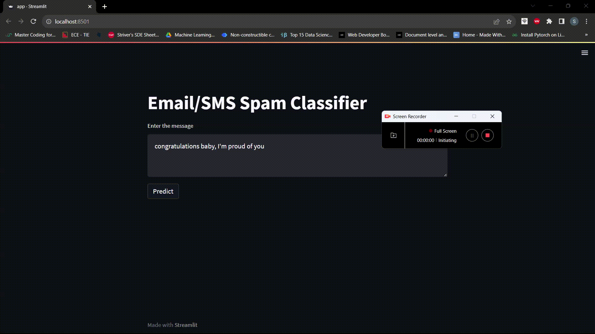

# Email Spam Classifier App

## Overview

The Email Spam Classifier App is a machine learning-based application designed to classify email or SMS messages as either "Spam" or "Not Spam" (Ham). The app uses Natural Language Processing (NLP) techniques, including the Term Frequency-Inverse Document Frequency (TF-IDF) vectorization method and various Naive Bayes classifiers, to predict the message's classification.

## Demo



## Dataset

The dataset used for training and testing the Email Spam Classifier app is sourced from Kaggle, specifically the "SMS Spam Collection Dataset." It contains a collection of SMS messages, labeled as "spam" or "ham" (non-spam). The data is preprocessed to remove any unnecessary information and ensure the text is ready for analysis.

## Text Vectorization

To transform the text data into a suitable format for machine learning, the Term Frequency-Inverse Document Frequency (TF-IDF) technique is employed. TF-IDF represents the importance of a word in a document relative to a collection of documents. This vectorization technique converts the text messages into a numerical format that can be used by machine learning algorithms.

## Machine Learning Algorithms

Three different Naive Bayes classifiers are implemented to predict whether a message is spam or not:

1. Multinomial Naive Bayes (MultinomialNB)
2. Bernoulli Naive Bayes (BernoulliNB)
3. Gaussian Naive Bayes (GaussianNB)

The performances of these classifiers are evaluated using the precision metric, which represents the accuracy of positive predictions (i.e., correctly classifying spam messages).

## Stemming

To further improve the performance of the classifiers, the NLTK (Natural Language Toolkit) library is used for text preprocessing. The text is tokenized and converted to lowercase before removing any non-alphanumeric characters. Additionally, stemming is applied using the Porter Stemmer from NLTK to reduce words to their root form. The stemmed text is then used for vectorization and classification.

## Results

The Email Spam Classifier App achieved the following precision values for different Naive Bayes classifiers:

- Bernoulli Naive Bayes (BernoulliNB) precision: 0.991869918699187
- Multinomial Naive Bayes (MultinomialNB) precision: 1.0
- Gaussian Naive Bayes (GaussianNB) precision: 0.509090909090909

Based on these results, the Multinomial Naive Bayes classifier achieved the highest precision, correctly classifying all spam messages in the test dataset.

The TF-IDF vectorization technique was found to be effective in representing text data for classification. It contributed to the accuracy of the classifiers by capturing important features in the messages.

The stemming process using the NLTK library helped in reducing the number of unique words in the dataset and improved the performance of the classifiers.

The Streamlit web application provided an interactive and user-friendly interface for predicting whether a message is spam or not. It facilitated real-time predictions based on user input.

Please note that the precision values mentioned above are based on the performance of the classifiers on the specific dataset used. The results may vary depending on the dataset and the specific messages to be classified.


## Web Application using Streamlit

To provide an easy-to-use interface for users to interact with the Email Spam Classifier, the app is developed using Streamlit. Streamlit allows the app to be deployed as a web application, enabling users to input a message and receive real-time predictions on whether the message is spam or not. The user interface is simple and intuitive, making it accessible to a wide range of users.

## Data Preparation

To execute the Email Spam Classifier App, follow these steps:

1. Ensure you have the necessary packages installed (Streamlit, NLTK, scikit-learn) in your Python environment.

2. Download the "SMS Spam Collection Dataset" from Kaggle and place it in the appropriate directory.

3. Preprocess the dataset and train the machine learning model using the provided notebook.

4. Generate the required files, including 'vectorizer.pkl' and 'model.pkl,' which are needed for the Streamlit app.

## Installation and Usage

To run the Email Spam Classifier App on your local machine, follow these steps:

1. Clone the repository to your local machine:

   ```
   git clone https://github.com/YourUsername/email-spam-classifier.git
   ```

2. Install the required dependencies:

   ```
   cd email-spam-classifier
   pip install -r requirements.txt
   ```

3. Ensure that you have the necessary files ('vectorizer.pkl' and 'model.pkl') in the same directory as the Streamlit app ('app.py').

4. Run the Streamlit app:

   ```
   streamlit run app.py
   ```

5. Access the application in your web browser at `http://localhost:8501`.

## Acknowledgments

- The "SMS Spam Collection Dataset" used in this project is sourced from Kaggle (provide the link to the dataset).

- The app utilizes the Streamlit library (https://streamlit.io/) for creating the web interface.

## Feedback and Contributions

Feedback and contributions to the Email Spam Classifier App are welcomed! Feel free to open an issue or submit a pull request with any suggestions or improvements you'd like to see.

Stay vigilant against spam! 📧🚫